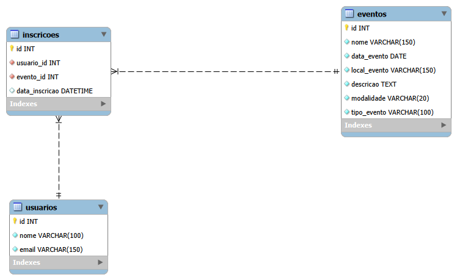

# UniEvento-Sistema-de-Gerenciamento-de-Eventos
Este projeto apresenta o UniEvento, um sistema de gerenciamento de eventos acadêmicos desenvolvido com foco em organização, simplicidade e usabilidade


## Implementação das Classes do MVP

O sistema **UniEvento** foi desenvolvido com base nos princípios de **Programação Orientada a Objetos (POO)**, buscando uma organização mais clara do código e maior facilidade de manutenção.

Foram implementadas duas classes principais: `Evento` e `GerenciadorEventos`.

### Classe `Evento`

A classe `Evento` representa a entidade principal do sistema, ou seja, cada evento cadastrado.

Ela possui os seguintes atributos:
- `id`
- `nome`
- `data`
- `local`
- `descricao`
- `modalidade`
- `tipo_evento`

Essa classe foi implementada com **encapsulamento**, utilizando atributos privados e métodos getters e setters para acesso e alteração dos dados.

Além disso, foram aplicadas **validações** nos setters para garantir maior consistência das informações, como:
- verificação de ID válido;
- nome com quantidade mínima de caracteres;
- descrição obrigatória;
- modalidade aceita apenas como `presencial` ou `online`.

A classe também sobrescreve o método `__str__`, facilitando a exibição formatada dos dados do evento no terminal.

### Classe `GerenciadorEventos`

A classe `GerenciadorEventos` é responsável por armazenar e gerenciar os eventos cadastrados no sistema.

Ela centraliza as principais operações deste CRUD:
- `cadastrar_evento()`
- `listar_eventos()`
- `consultar_evento_por_id()`
- `atualizar_evento()`
- `remover_evento()`

Os eventos são armazenados em uma lista em memória, o que atende à proposta do MVP da atividade.

Essa classe também garante algumas regras de negócio, como impedir o cadastro de eventos com IDs duplicados e permitir a busca e atualização de registros existentes.

### Considerações sobre a implementação

O sistema foi desenvolvido como um **MVP**, com foco nas funcionalidades essenciais de gerenciamento de eventos.

A interação com o usuário ocorre por meio de um **menu interativo no terminal**, permitindo executar as operações de cadastro, listagem, consulta, atualização e remoção de eventos.

Embora o banco de dados tenha sido modelado separadamente, nesta versão o código em Python funciona de forma independente, utilizando armazenamento temporário em memória.


## Diagrama do Banco de Dados

A imagem abaixo representa o modelo relacional do sistema UniEvento, evidenciando as tabelas e seus relacionamentos.



## Estrutura das Tabelas

O banco de dados do sistema **UniEvento** foi modelado com as seguintes tabelas principais:

- **usuarios**: armazena os dados dos usuários do sistema, possibilitando o cadastro de participantes.  
- **eventos**: registra os eventos acadêmicos cadastrados na plataforma, contendo informações como nome, data, local, descrição, modalidade e tipo do evento.  
- **inscricoes**: representa a relação entre usuários e eventos, armazenando as inscrições realizadas.

As tabelas foram definidas com:
- **Chaves primárias (PK)** para identificação única dos registros;
- **Chaves estrangeiras (FK)** para manter a integridade entre as tabelas;
- **Restrições como NOT NULL e UNIQUE** para garantir consistência;
- **Tipos de dados adequados** para cada informação, como `VARCHAR`, `INT`, `DATE` e `DATETIME`.

---

## TABELA USUARIOS

| Atributo | Tipo de Dado | Chave | Índice | Restrição |
|---------|-------------|------|--------|----------|
| id | INT | PK | ✔ | NOT NULL, AUTO_INCREMENT |
| nome | VARCHAR(100) |  |  | NOT NULL |
| email | VARCHAR(150) |  | ✔ | NOT NULL, UNIQUE |

---

## TABELA EVENTOS

| Atributo | Tipo de Dado | Chave | Índice | Restrição |
|---------|-------------|------|--------|----------|
| id | INT | PK | ✔ | NOT NULL, AUTO_INCREMENT |
| nome | VARCHAR(150) |  | ✔ | NOT NULL |
| data_evento | DATE |  | ✔ | NOT NULL |
| local_evento | VARCHAR(150) |  |  | NOT NULL |
| descricao | TEXT |  |  | NOT NULL |
| modalidade | VARCHAR(20) |  |  | NOT NULL |
| tipo_evento | VARCHAR(100) |  |  | NOT NULL |

---

## TABELA INSCRICOES

| Atributo | Tipo de Dado | Chave | Índice | Restrição |
|---------|-------------|------|--------|----------|
| id | INT | PK | ✔ | NOT NULL, AUTO_INCREMENT |
| usuario_id | INT | FK | ✔ | NOT NULL |
| evento_id | INT | FK | ✔ | NOT NULL |
| data_inscricao | DATETIME |  |  | DEFAULT CURRENT_TIMESTAMP |

---

## Modelagem SQL para Prototipar o Modelo Físico

Foi desenvolvido o script SQL responsável pela criação das tabelas, seus atributos e relacionamentos, permitindo posteriormente a geração do modelo físico do banco de dados do sistema **UniEvento**.

```sql
DROP DATABASE IF EXISTS unievento;

CREATE DATABASE unievento;
USE unievento;

CREATE TABLE usuarios (
    id INT AUTO_INCREMENT PRIMARY KEY,
    nome VARCHAR(100) NOT NULL,
    email VARCHAR(150) NOT NULL UNIQUE
);

CREATE TABLE eventos (
    id INT AUTO_INCREMENT PRIMARY KEY,
    nome VARCHAR(150) NOT NULL,
    data_evento DATE NOT NULL,
    local_evento VARCHAR(150) NOT NULL,
    descricao TEXT NOT NULL,
    modalidade VARCHAR(20) NOT NULL,
    tipo_evento VARCHAR(100) NOT NULL
);

CREATE TABLE inscricoes (
    id INT AUTO_INCREMENT PRIMARY KEY,
    usuario_id INT NOT NULL,
    evento_id INT NOT NULL,
    data_inscricao DATETIME DEFAULT CURRENT_TIMESTAMP,
    FOREIGN KEY (usuario_id) REFERENCES usuarios(id),
    FOREIGN KEY (evento_id) REFERENCES eventos(id)
);

CREATE INDEX idx_eventos_nome ON eventos(nome);
CREATE INDEX idx_eventos_data ON eventos(data_evento);
```

## Wireframe e Sitemap

O wireframe do sistema **UniEvento** foi desenvolvido com foco em simplicidade, organização e usabilidade, seguindo o padrão de aplicações web.

As telas principais projetadas foram:

### 1. Tela Inicial
A tela inicial apresenta o nome do sistema e permite o acesso às funcionalidades principais, servindo como ponto de entrada para o usuário.

### 2. Tela de Listagem de Eventos
Essa é a tela principal do sistema, responsável por exibir os eventos cadastrados.

Nela é possível visualizar informações como:
- nome;
- data;
- local;
- modalidade;
- tipo do evento.

Também são disponibilizadas as principais ações do sistema:
- cadastrar novo evento;
- visualizar detalhes;
- editar;
- excluir.

### 3. Tela de Formulário de Evento (Cadastro/Edição)
A tela de formulário é utilizada tanto para cadastro quanto para edição de eventos, reutilizando a mesma estrutura.

Os campos definidos foram:
- nome do evento;
- data do evento;
- local do evento;
- descrição;
- modalidade;
- tipo do evento.

### 4. Tela de Detalhes do Evento
A tela de detalhes exibe as informações completas de um evento selecionado.

Essa tela representa a funcionalidade de consulta do sistema, permitindo visualizar todos os dados do evento de forma organizada.

---

## Fluxo entre as telas

O fluxo principal do sistema ocorre da seguinte forma:

- **Tela Inicial** → acesso ao sistema  
- **Listagem de Eventos** → visualização e gerenciamento  
- **Listagem de Eventos** → acesso às ações (cadastrar, visualizar, editar e excluir)  
- **Formulário de Evento** → criação ou atualização de eventos  
- **Detalhes do Evento** → exibição completa das informações  

---

## Sitemap

Representação do Sitemap:

- Tela Inicial  
  - Listagem de Eventos  
    - Formulário de Evento (Cadastro/Edição)  
    - Detalhes do Evento  
    - Exclusão de Evento  

---

## Imagens do Wireframe


